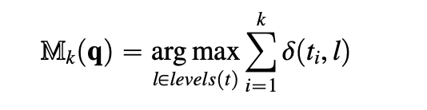
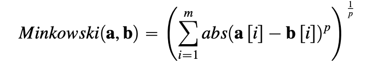
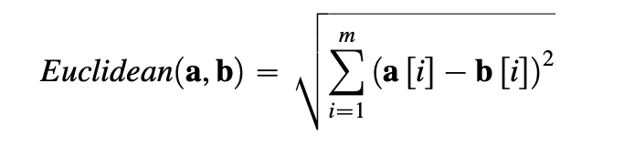
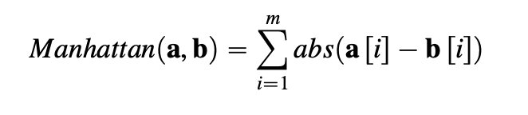
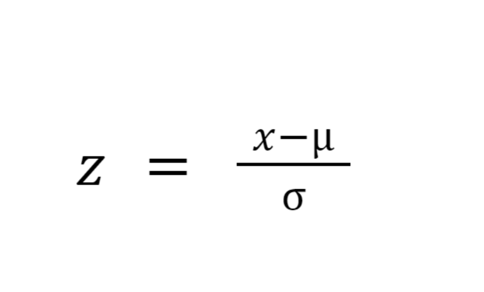
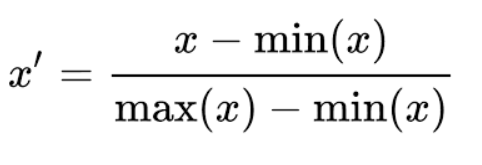

# KNN-from-scratch
This project demonstrates the implementation of the k-Nearest Neighbors (k-NN) algorithm entirely from scratch in Python. Unlike most implementations, this project does not use any machine learning imports nor basic libraries like math, numpy, or pandas. The goal is to provide an extremely fundamental, step-by-step approach to understanding this classic machine learning algorithm.

- **Visual Explanation of k-NN**:  
  The following diagram illustrates how the k-NN algorithm works:  
  

where **M**k(**q**) is the prediction of the model **M** for the query **q** given the parameter of
the model k; *levels(t)* is the set of levels in the domain of the target feature, and *l* is an
element of this set; *i* iterates over the instances **d**i in increasing distance from the query
**q**; ti is the value of the target feature for instance **d**i; and δ(ti,l) is the Kronecker delta
function, which takes two parameters and returns 1 if they are equal and 0 otherwise.

## Features

### **1. Pure Python Implementation**
  - No external libraries or helper functions are used. Everything is built from the ground up.
    
### **2. Multiple Distance Metrics**
  - The project supports the following distance metrics, implemented manually:
    - **Minkowski Distance**  
      
    - **Euclidean Distance**  
      
    - **Manhattan Distance**  
      

  ### **3. Scalers**
  To preprocess data effectively, two scaling methods are implemented from scratch:

  - **Standard Scaler**  
  Standardizes features by removing the mean and scaling to unit variance:  
    

- **Min-Max Scaler**  
  Scales features to a fixed range, typically \([0, 1]\):  
    

  ## Usage
1. **Dataset Preparation**
   - Generate a dataset with training and test data.

2. **Data Scaling (Optional)**
   - Use the `ScaleData` class to scale features using either `standard` or `minmax` scaling.

3. **Train and Predict**
   - Fit the k-NN model with training data and predict for test data.

## To-Do
- [ ] Add support for additional distance metrics (e.g., cosine similarity).
- [ ] Add accuracy for classification.
- [ ] Add regression.
- [ ] Add visualization tools for decision boundaries.
      
